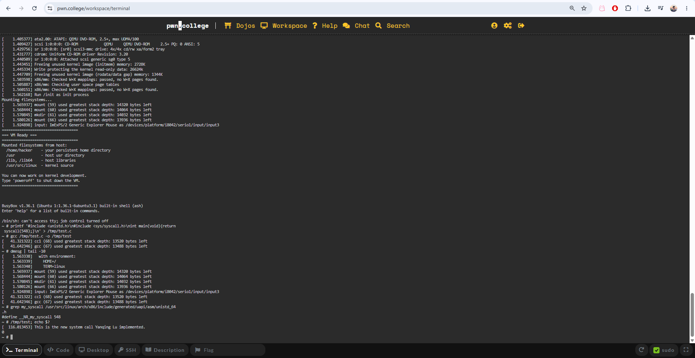
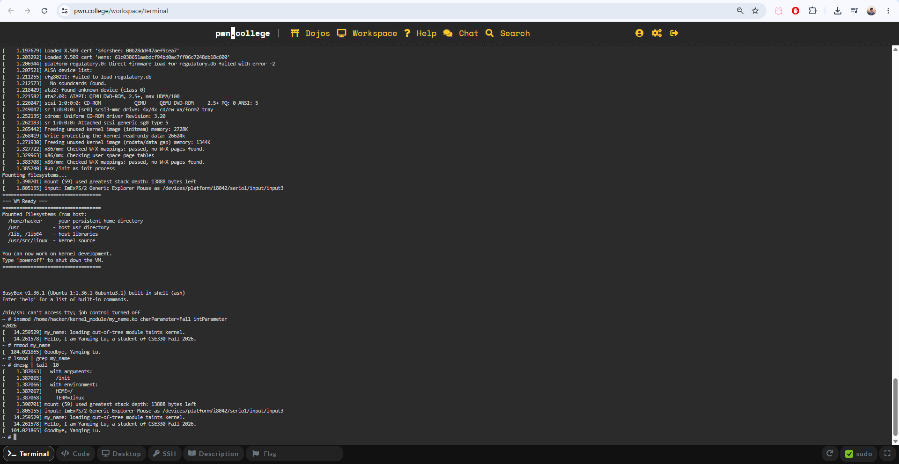

# Linux Kernel Systems Lab

Hands-on Linux systems work exploring the boundary between userspace applications and privileged kernel execution.

The initial project involved extending an x86-64 Linux kernel with a custom system call and developing a loadable kernel module with configurable runtime parameters.

> **Academic integrity:** This repository documents architecture, concepts, experiments, and results from systems coursework. Graded assignment solution source is not published here.

## Technologies

**C · Linux Kernel · x86-64 · GCC · Make · QEMU · Linux CLI**

## Architecture

### System Call Path

```text
Userspace C program
        |
        | syscall()
        v
x86-64 syscall interface
        |
        v
Linux kernel
        |
        v
custom syscall handler
        |
        | printk()
        v
kernel log
```

### Loadable Kernel Module Path

```text
Userspace
    |
    | insmod
    v
Loadable kernel module (.ko)
    |
    +-- string parameter
    +-- integer parameter
    |
    v
Kernel execution
    |
    | rmmod
    v
Module cleanup
```

## What I Implemented

### Custom System Call

- Integrated a custom system call into an x86-64 Linux kernel.
- Connected the syscall implementation, syscall table, declarations, and kernel build configuration.
- Rebuilt and booted the modified kernel in a virtual machine.
- Invoked the syscall from a C userspace program.
- Verified kernel execution through kernel logging.

### Loadable Kernel Module

- Implemented a loadable Linux kernel module in C.
- Added configurable string and integer module parameters.
- Compiled the module against the Linux kernel source tree.
- Loaded and unloaded the module using `insmod` and `rmmod`.
- Verified initialization and cleanup through `dmesg`.

## Systems Concepts

This project provided hands-on experience with:

- userspace and kernel-space separation
- system-call interfaces
- privileged execution
- Linux kernel compilation
- loadable kernel modules
- kernel logging and debugging
- userspace-to-kernel transitions

## Systems Security Relevance

System calls and kernel modules operate across critical operating-system privilege boundaries. Working directly with these mechanisms provided practical context for understanding controlled entry into privileged code, kernel attack surface, and why privileged interfaces must be carefully designed and validated.

This systems foundation supports my broader interest in secure distributed computing and AI infrastructure.

## Development Environment

- **Architecture:** x86-64
- **Kernel development:** Linux 6.10
- **Host environment:** Ubuntu Linux
- **Compiler:** GCC
- **Virtualization:** QEMU
- **Development environment:** pwn.college

## Demonstration

### Custom System Call

The userspace test invokes the custom x86-64 system call and verifies successful execution through the kernel log.



### Loadable Kernel Module

The module is loaded with runtime parameters, executes initialization code in kernel space, and is subsequently unloaded with its cleanup path verified through the kernel log.



## Next Steps

I plan to extend this repository with independent Linux experiments involving:

- process and privilege boundaries
- system-call behavior
- kernel/user memory interaction
- Linux permissions and capabilities
- systems-security concepts

These additions will contain independently developed examples rather than graded coursework solutions.
